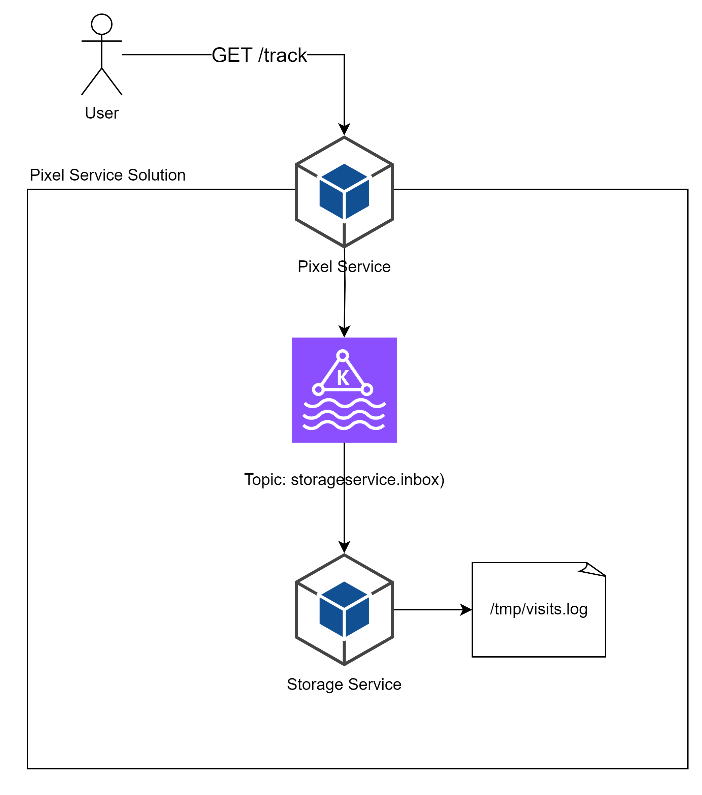

# Pixel Track Service 💻

Welcome to Pixel service, an application that uses HTTP requests to collect informations from user, including data such as IP address and request headers.

## How it works ⭐
When receiving a request on the `/track` endpoint in Pixel Service, it will return a 1px transparent png image and send a command via kafka to the Storage Service, which will process it and record it in a log file.

## Diagram

    

## Usage ✍️

1. Clone the repository.
2. Inside root path, run `docker-compose up`.
3. Thats it! Up, running and available via swagger on [port 5254](http://localhost:5254/swagger)🚀
5. The log file can be found on `tmp/visits.log`

## Custom configurations ⚒️
- **Pixel Service**: You can configure the PNG image location by changing the ENV variable `DATA__PNGLOCATION` locate on your docker file.
- **Storage Service**: You can configure the `visits.log` location by changing the ENV variable `DATA__FILELOCATION` locate on your docker file.

## Technology 👨‍💻
- Both services are developed in .Net 8 and use Kafka to communicate to each other.
- Both services have a `Contracts` project to maintain all messages that can be exchanged with each other.
The idea is to have only 1 package, used by both. But this would make it impossible to restore the packages without more complex development.

